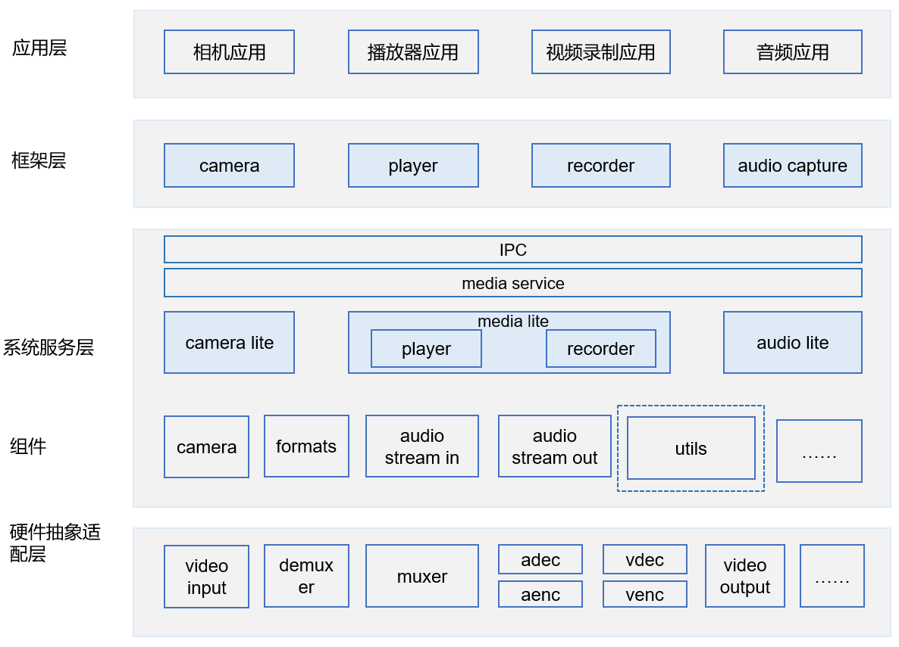

# 媒体子系统MEDIA\_UTILS\_LITE组件<a name="ZH-CN_TOPIC_0000001127127417"></a>

- [媒体子系统MEDIA\_UTILS\_LITE组件<a name="ZH-CN_TOPIC_0000001127127417"></a>](#媒体子系统media_utils_lite组件)
  - [简介<a name="section11660541593"></a>](#简介)
  - [目录<a name="section8685144625320"></a>](#目录)
  - [使用说明<a name="section1648194512427"></a>](#使用说明)
  - [约束<a name="section161941989596"></a>](#约束)
  - [相关仓<a name="section105062051111614"></a>](#相关仓)

## 简介<a name="section11660541593"></a>

提供媒体错误码等公用信息的定义，以及录制、播放音频和视频所需的数据类型。

数据类型：

-   SourceType：播放片源类型
-   BufferFlags：Buffer承载数据标识
-   AudioSourceType：定义音频输入源类型枚举
-   AudioCodecFormat：定义音频数据格式枚举
-   AudioStreamType：定义音频流类型枚举
-   AudioBitWidth：定义采样位宽枚举

错误码：

<a name="table7158151314620"></a>
<table><thead align="left"><tr id="row1722018139620"><th class="cellrowborder" valign="top" width="24.95%" id="mcps1.1.4.1.1"><p id="p172202131066"><a name="p172202131066"></a><a name="p172202131066"></a>错误代码</p>
</th>
<th class="cellrowborder" valign="top" width="42.91%" id="mcps1.1.4.1.2"><p id="p5220913569"><a name="p5220913569"></a><a name="p5220913569"></a>宏定义</p>
</th>
<th class="cellrowborder" valign="top" width="32.14%" id="mcps1.1.4.1.3"><p id="p1722061317617"><a name="p1722061317617"></a><a name="p1722061317617"></a>描述</p>
</th>
</tr>
</thead>
<tbody><tr id="row1422020137612"><td class="cellrowborder" valign="top" width="24.95%" headers="mcps1.1.4.1.1 "><p id="p202201213562"><a name="p202201213562"></a><a name="p202201213562"></a>0xffffffff</p>
</td>
<td class="cellrowborder" valign="top" width="42.91%" headers="mcps1.1.4.1.2 "><p id="p0220171317612"><a name="p0220171317612"></a><a name="p0220171317612"></a>ERR_INVALID_READ</p>
</td>
<td class="cellrowborder" valign="top" width="32.14%" headers="mcps1.1.4.1.3 "><p id="p82208133618"><a name="p82208133618"></a><a name="p82208133618"></a>读数据失败</p>
</td>
</tr>
<tr id="row82203139620"><td class="cellrowborder" valign="top" width="24.95%" headers="mcps1.1.4.1.1 "><p id="p1122013131168"><a name="p1122013131168"></a><a name="p1122013131168"></a>0x0</p>
</td>
<td class="cellrowborder" valign="top" width="42.91%" headers="mcps1.1.4.1.2 "><p id="p1322011315617"><a name="p1322011315617"></a><a name="p1322011315617"></a>SUCCESS</p>
</td>
<td class="cellrowborder" valign="top" width="32.14%" headers="mcps1.1.4.1.3 "><p id="p142207137613"><a name="p142207137613"></a><a name="p142207137613"></a>操作成功</p>
</td>
</tr>
<tr id="row15220213066"><td class="cellrowborder" valign="top" width="24.95%" headers="mcps1.1.4.1.1 "><p id="p14220131313612"><a name="p14220131313612"></a><a name="p14220131313612"></a>0x3c10000</p>
</td>
<td class="cellrowborder" valign="top" width="42.91%" headers="mcps1.1.4.1.2 "><p id="p1822016133612"><a name="p1822016133612"></a><a name="p1822016133612"></a>ERROR</p>
</td>
<td class="cellrowborder" valign="top" width="32.14%" headers="mcps1.1.4.1.3 "><p id="p1422071317614"><a name="p1422071317614"></a><a name="p1422071317614"></a>操作失败</p>
</td>
</tr>
<tr id="row3220191311619"><td class="cellrowborder" valign="top" width="24.95%" headers="mcps1.1.4.1.1 "><p id="p22201013865"><a name="p22201013865"></a><a name="p22201013865"></a>0x3c10001</p>
</td>
<td class="cellrowborder" valign="top" width="42.91%" headers="mcps1.1.4.1.2 "><p id="p52211813262"><a name="p52211813262"></a><a name="p52211813262"></a>ERR_ILLEGAL_STATE</p>
</td>
<td class="cellrowborder" valign="top" width="32.14%" headers="mcps1.1.4.1.3 "><p id="p102211913669"><a name="p102211913669"></a><a name="p102211913669"></a>状态错误</p>
</td>
</tr>
<tr id="row1222119131064"><td class="cellrowborder" valign="top" width="24.95%" headers="mcps1.1.4.1.1 "><p id="p152211413962"><a name="p152211413962"></a><a name="p152211413962"></a>0x2A05</p>
</td>
<td class="cellrowborder" valign="top" width="42.91%" headers="mcps1.1.4.1.2 "><p id="p7221113864"><a name="p7221113864"></a><a name="p7221113864"></a>ERR_INVALID_PARAM</p>
</td>
<td class="cellrowborder" valign="top" width="32.14%" headers="mcps1.1.4.1.3 "><p id="p12211813968"><a name="p12211813968"></a><a name="p12211813968"></a>参数无效</p>
</td>
</tr>
<tr id="row1122110131163"><td class="cellrowborder" valign="top" width="24.95%" headers="mcps1.1.4.1.1 "><p id="p1222111131761"><a name="p1222111131761"></a><a name="p1222111131761"></a>0x3c10003</p>
</td>
<td class="cellrowborder" valign="top" width="42.91%" headers="mcps1.1.4.1.2 "><p id="p1622171317617"><a name="p1622171317617"></a><a name="p1622171317617"></a>ERR_EARLY_PREPARE</p>
</td>
<td class="cellrowborder" valign="top" width="32.14%" headers="mcps1.1.4.1.3 "><p id="p1722117131610"><a name="p1722117131610"></a><a name="p1722117131610"></a>媒体启动提前</p>
</td>
</tr>
<tr id="row1322191310611"><td class="cellrowborder" valign="top" width="24.95%" headers="mcps1.1.4.1.1 "><p id="p2221713569"><a name="p2221713569"></a><a name="p2221713569"></a>0x3c10004</p>
</td>
<td class="cellrowborder" valign="top" width="42.91%" headers="mcps1.1.4.1.2 "><p id="p1422115131164"><a name="p1422115131164"></a><a name="p1422115131164"></a>ERR_SOURCE_NOT_SET</p>
</td>
<td class="cellrowborder" valign="top" width="32.14%" headers="mcps1.1.4.1.3 "><p id="p1722119131068"><a name="p1722119131068"></a><a name="p1722119131068"></a>媒体源未设置</p>
</td>
</tr>
<tr id="row62216139614"><td class="cellrowborder" valign="top" width="24.95%" headers="mcps1.1.4.1.1 "><p id="p182218133619"><a name="p182218133619"></a><a name="p182218133619"></a>0x3c10005</p>
</td>
<td class="cellrowborder" valign="top" width="42.91%" headers="mcps1.1.4.1.2 "><p id="p72211813061"><a name="p72211813061"></a><a name="p72211813061"></a>ERR_INVALID_OPERATION</p>
</td>
<td class="cellrowborder" valign="top" width="32.14%" headers="mcps1.1.4.1.3 "><p id="p2221161310618"><a name="p2221161310618"></a><a name="p2221161310618"></a>无效操作</p>
</td>
</tr>
<tr id="row2022111312610"><td class="cellrowborder" valign="top" width="24.95%" headers="mcps1.1.4.1.1 "><p id="p1722111139618"><a name="p1722111139618"></a><a name="p1722111139618"></a>0x2A09</p>
</td>
<td class="cellrowborder" valign="top" width="42.91%" headers="mcps1.1.4.1.2 "><p id="p12211713767"><a name="p12211713767"></a><a name="p12211713767"></a>ERR_NOFREE_CHANNEL</p>
</td>
<td class="cellrowborder" valign="top" width="32.14%" headers="mcps1.1.4.1.3 "><p id="p1622115137617"><a name="p1622115137617"></a><a name="p1622115137617"></a>通道无空闲</p>
</td>
</tr>
<tr id="row8221201314611"><td class="cellrowborder" valign="top" width="24.95%" headers="mcps1.1.4.1.1 "><p id="p122217138616"><a name="p122217138616"></a><a name="p122217138616"></a>0x3c10007</p>
</td>
<td class="cellrowborder" valign="top" width="42.91%" headers="mcps1.1.4.1.2 "><p id="p1022110130620"><a name="p1022110130620"></a><a name="p1022110130620"></a>ERR_READ_BUFFER</p>
</td>
<td class="cellrowborder" valign="top" width="32.14%" headers="mcps1.1.4.1.3 "><p id="p1322116131064"><a name="p1322116131064"></a><a name="p1322116131064"></a>读缓冲区出错</p>
</td>
</tr>
<tr id="row142221813263"><td class="cellrowborder" valign="top" width="24.95%" headers="mcps1.1.4.1.1 "><p id="p32221713964"><a name="p32221713964"></a><a name="p32221713964"></a>0x3c10008</p>
</td>
<td class="cellrowborder" valign="top" width="42.91%" headers="mcps1.1.4.1.2 "><p id="p1622221317615"><a name="p1622221317615"></a><a name="p1622221317615"></a>ERR_NOT_STARTED</p>
</td>
<td class="cellrowborder" valign="top" width="32.14%" headers="mcps1.1.4.1.3 "><p id="p11222413963"><a name="p11222413963"></a><a name="p11222413963"></a>设备未启动</p>
</td>
</tr>
<tr id="row1922217130615"><td class="cellrowborder" valign="top" width="24.95%" headers="mcps1.1.4.1.1 "><p id="p19222213267"><a name="p19222213267"></a><a name="p19222213267"></a>0x3c100c8</p>
</td>
<td class="cellrowborder" valign="top" width="42.91%" headers="mcps1.1.4.1.2 "><p id="p32221213768"><a name="p32221213768"></a><a name="p32221213768"></a>ERR_UNKNOWN</p>
</td>
<td class="cellrowborder" valign="top" width="32.14%" headers="mcps1.1.4.1.3 "><p id="p20222171320618"><a name="p20222171320618"></a><a name="p20222171320618"></a>未知错误</p>
</td>
</tr>
</tbody>
</table>

**图 1**  媒体子系统架构（蓝色虚线框是media\_utils）<a name="fig9521193714117"></a>  


## 目录<a name="section8685144625320"></a>

```
foundation/multimedia/utils/lite
├── interfaces    # 数据类型和媒体格式头文件
└── hals       # HAL层适配接口
└── src        # 数据类型和媒体格式实现
```

## 使用说明<a name="section1648194512427"></a>

单仓的编译构建，在根目录下进行单仓的构建和编译

```
# 开发板选择
hb set  
# 构建和编译
hb build media_service
```

## 约束<a name="section161941989596"></a>

C++11版本或以上

## 相关仓<a name="section105062051111614"></a>

[媒体子系统](https://gitee.com/openharmony/docs/blob/master/zh-cn/readme/%E5%AA%92%E4%BD%93%E5%AD%90%E7%B3%BB%E7%BB%9F.md)

[camera\_lite](https://gitee.com/openharmony/multimedia_camera_lite/blob/master/README_zh.md)

[camera\_sample\_lite](https://gitee.com/openharmony/applications_sample_camera/blob/master/README_zh.md)

[audio\_lite](https://gitee.com/openharmony/multimedia_audio_lite/blob/master/README_zh.md)

[media\_lite](https://gitee.com/openharmony/multimedia_media_lite/blob/master/README_zh.md)

[media\_utils\_lite](https://gitee.com/openharmony/multimedia_utils_lite)

